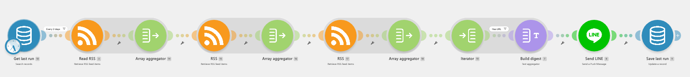

# Make 自動化 AI 相關新聞推送
> 利用 Make 和 Line bot 設計一自動化流程，即時掌握 AI 最新發展與業界動態，持續累積 AI 領域及相關英文用語的識讀能力
---

## 專案流程

---

## 專案動機
 
每天手動瀏覽多個科技新聞網站耗時費力，且容易遺漏重要資訊。  
因此透過自動化工具建立這套系統，讓 AI 相關新聞每天早上自動送到手機，  
同時藉由閱讀英文原文內容，持續累積 AI 領域及相關英文用語的識讀能力。
 
---

## 功能說明
 
- 每日上午 8 點自動執行，從多個知名科技新聞網站蒐集最新 AI 相關新聞
- 自動擷取 3–5 筆新聞摘要，並整理原文網址
- 透過 Line Bot 將摘要與連結一併推送至手機
- 建立資料庫記錄已推送內容，自動過濾重複新聞，避免重複推送

---

## 使用工具
 
| 工具 | 用途 |
|------|------|
| [Make](https://www.make.com) | 自動化 Workflow 建立與排程執行 |
| Line Messaging API | 連結 Line Bot 傳送訊息 |
| Make內建資料庫 | 儲存已推送新聞 |

---

